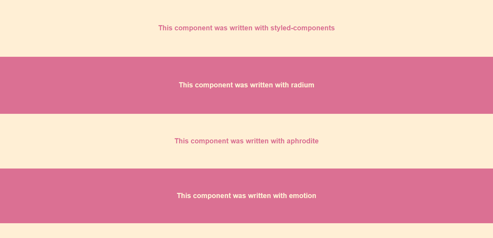

# React CSS-in-JS Demos

This React app provides a basic comparison of the uses of some popular CSS-in-JS libraries.

The following libraries are compared:

- [styled-components/styled-components](https://github.com/styled-components/styled-components)
- [FormidableLabs/radium](https://github.com/FormidableLabs/radium)
- [Khan/aphrodite](https://github.com/Khan/aphrodite)
- [emotion-js/emotion](https://github.com/emotion-js/emotion)
- [rofrischmann/fela](https://github.com/rofrischmann/fela)
- [styletron/styletron](https://github.com/styletron/styletron)
- [cssinjs/jss](https://github.com/cssinjs/jss)

## How to run

- `git clone https://github.com/DanielArthurUK/css-in-js-demos.git`
- `cd css-in-js-demos`
- `npm start`

The example application will then be available to view on port 3000.

## Contributing

If you wish to add an example for another library, feel free to open a PR :tada: